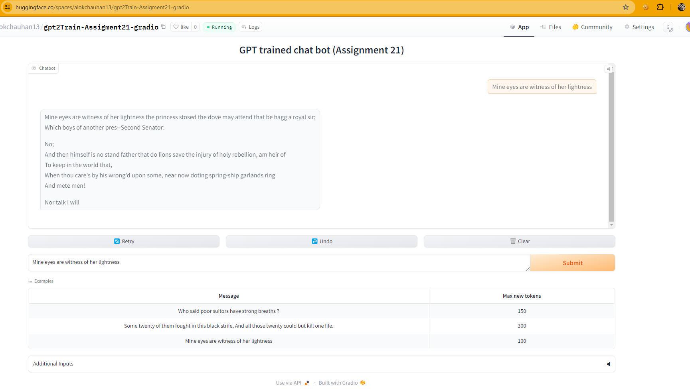

# assignment-21
Performance improvement in GPT

[Gradio-App](https://huggingface.co/spaces/alokchauhan13/gpt2Train-Assigment21-gradio)

## 1- Setting basic structure of GPT

- Load pre trained model from gpt2
- Will get predictions

## 2- Initializing the empty model
- Using tiktoken encoding from gpt2
- Removed pre-trained model and initializing model randomly

Result: Will create random prediction
In next we will train model.

## 3- Loading random model and calculating logits only

logits refer to the output values of the final layer before the softmax function is applied.

The softmax function is a mathematical trick that transforms these raw scores (logits) into actual probabilities between 0 and 1. It ensures all the probabilities for all possible words add up to 1, making it a valid probability distribution.

- we know what device we are running on
- Only for 1000 words
- batch size 4, token size = 32
- executing model and calculating logits only. No training

## 4- Additional calculating loss

- We are calculating loss only.

## 5- Propagating loss and added AdamW optimizer. Training model

- We are calculating loss iteratively while model training.
- Now loss started reducing

## 6- Create data loader to train model 

- Created data loader class which takes batch and token size as input
- executed training using data loader

## 7- weight sharing

- We are following GPT 3 paper
- we want to control the std within 1 for extreme values 

## 8- Solving for weight initialization

- Updating init weight with std

## 9.1- Solving for residual std scaling issue

- In training added time measurement 
- In GPU , training loop can run in parallel by GPU. This can create a problem in back propagation.  We add torch.cuda.synchronize()  for synchronization 
- Code after torch.cuda.synchronize we are not halting gpu to execute other code. So code after that will continue to run on cpu as needed.
- On laptop output was 

step49 | loss: 5.974148750305176 | dt: 9038.90ms | tok/sec:  906.30

## 9.2- Increasing speed  via moving to bfloat16

- added torch.set_float32_matmul_precision('high'). This move the numbers to bfloat16
- Compare token/sec changes and total time.
- Moved calculation to bfloat16 . Not model coefficient.

## 9.3- Increasing speed  via adding torch.autocast to bfloat16

- Added torch.autocast(device_type=device, dtype=torch.bfloat16)
- By this we moved model weight and loss moved to bfloat16
- step49 | loss: 6.201848983764648 | dt: 1226.86ms | tok/sec:  6677.24
- Back propagation still happening in float 32

### NOTE: Gradient Scaling

If the forward pass for a particular op has float16 inputs, the backward pass for that op will produce float16 gradients. Gradient values with small magnitudes may not be representable in float16. These values will flush to zero (“underflow”), so the update for the corresponding parameters will be lost.

To prevent underflow, “gradient scaling” multiplies the network’s loss(es) by a scale factor and invokes a backward pass on the scaled loss(es). Gradients flowing backward through the network are then scaled by the same factor. In other words, gradient values have a larger magnitude, so they don’t flush to zero.

Reference:
- [CUDA Automatic Mixed Precision examples](https://pytorch.org/docs/stable/notes/amp_examples.html)
- [Gradient Scaling](https://pytorch.org/docs/stable/amp.html#gradient-scaling)

## 9.4- Increasing speed via torch.compile(model)

- Only for colab. use torch.compile. Works on linux 
- Add model = torch.compile(model)
- Good speed change on Linux
- Error on windows: raise RuntimeError("Windows not yet supported for torch.compile")

## 9.5- Increasing speed via flash attention

- GPU try uses GPU SRAM, know as flash attention
- Memory efficient execution 
- remove attention code and added F.scaled_dot_product_attention(q, k, v, is_causal = True) # Flash attention
- Increased free memory RAM
With 16 Batch size
- step49 | loss: 6.551949501037598 | dt: 1584.15ms | tok/sec:  10342.44

With 8 Batch size
step49 | loss: 6.155158042907715 | dt: 372.89ms | tok/sec:  21969.11
- Now we have also increased batch size to 16

## 9.6- Increasing speed via vocab size

- We are changing some of the hyper parameters
- We are changing vocab size to 50304 so that it is power of 2. So we are adding blank space but read is faster.
- step49 | loss: 6.464817523956299 | dt: 1447.21ms | tok/sec:  11321.11
- Some minor increase in tok/sec and decrease in time

## 9.7- Increasing speed via change in hyper parameter

- Parameters taken from GPT 3 paper
- Updating , model training, hyper parameters, Adam W and gradient clipping 
- 

- Optimizer change: optimizer = torch.optim.AdamW(model.parameters(), lr = 3e-4, betas=(0.9, 0.95), eps=1e-8)
- Gradient clipping: norm = torch.nn.utils.clip_grad_norm(model.parameters(), 1.0)
- Gradient making sure gradient not more than 1. Printing gradient value
- step49 | loss: 6.5908708572387695 | dt: 1575.63ms | tok/sec:  10398.39 | norm: 1.85
- Gradient clipping stopping the shock to the model

## 9.8- Increasing speed Add cosine delay for training the lr function 

- Instead of one cycle policy use cosine delay
- CODE UPDATE HERE
    - max_lr = 6e-4 
    - min_lr = max_lr * 0.1
    - warmup_steps = 10
    - max_steps = 50
    - Added get_lr method

- step49 | loss: 6.499133586883545 | dt: 1657.21ms | tok/sec:  9886.50 | norm: 1.58

## 9.9- Increasing speed via Update weight decay in configuring optimizer

- Complex update code change for optimizer.
- Update lr for some parameters not for all parameters
- Need to read research paper
- step49 | loss: 6.5048089027404785 | dt: 1607.44ms | tok/sec:  10192.59 | norm: 1.61
